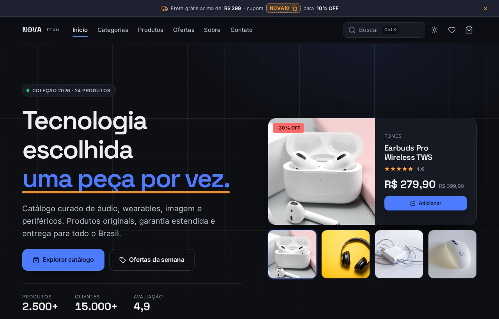
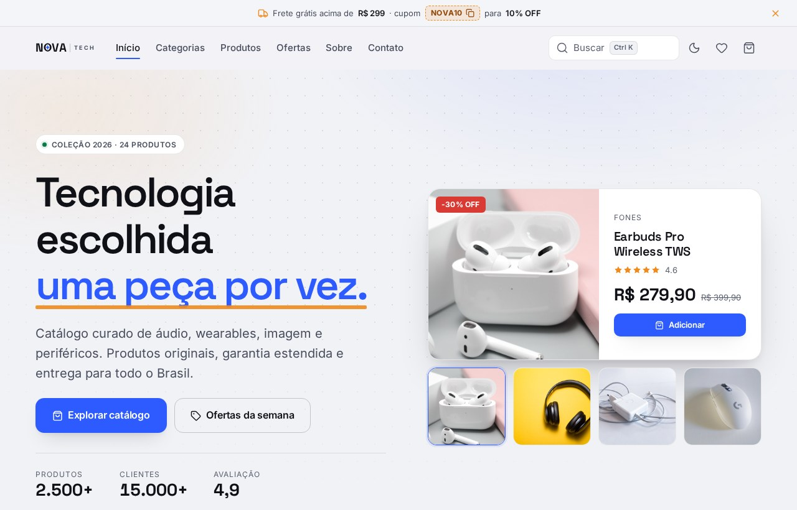
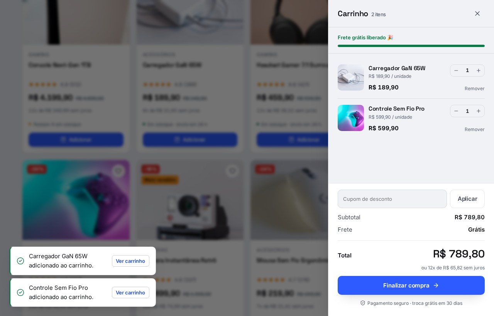
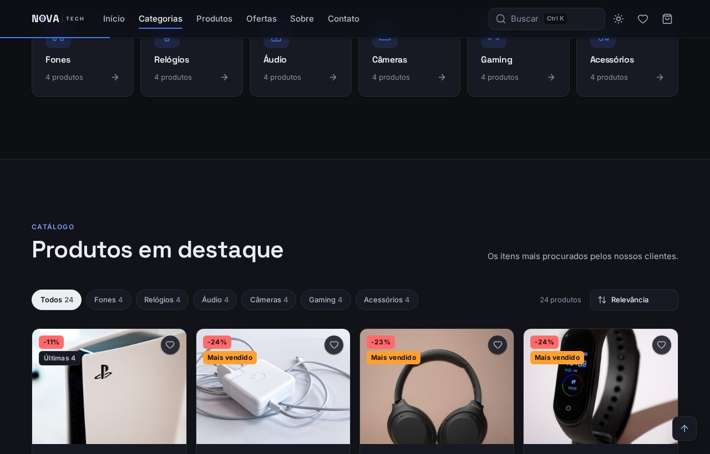

<h1 align="center">NovaTech</h1>

<p align="center">
  Loja de tecnologia responsiva em HTML, CSS e JavaScript puros.<br>
  Sem build, sem framework, sem dependência de runtime — abrir o <code>index.html</code> já é o produto rodando.
</p>

<p align="center">
  <a href="https://loja-online-one-eta.vercel.app/"><strong>Ver demo ao vivo →</strong></a>
</p>

<p align="center">
  
  
  
  
  
  <a href="https://loja-online-one-eta.vercel.app/"></a>
</p>

<p align="center">
  
  
</p>

---

## Sumário

- [O que tem dentro](#o-que-tem-dentro)
- [Direção de design](#direção-de-design)
- [A marca](#a-marca)
- [Acessibilidade](#acessibilidade)
- [Estrutura](#estrutura)
- [Rodando localmente](#rodando-localmente)
- [Deploy](#deploy)
- [Personalizando](#personalizando)
- [Créditos](#créditos)

---

## O que tem dentro

### Compra

| | |
|---|---|
| **Carrinho persistente** | Quantidade por item, validação contra o estoque real do produto e estado salvo em `localStorage` |
| **Medidor de frete grátis** | Barra de progresso mostrando quanto falta para os R$ 299 |
| **Cupons funcionais** | `NOVA10` (10%), `NOVATECH20` (20%) e `FRETEGRATIS` |
| **Parcelamento** | Calculado por produto e no total: até 12x, parcela mínima de R$ 30 |
| **Visualização rápida** | Modal com descrição, ficha técnica e estoque, sem sair da grade |
| **Lista de desejos** | Painel próprio, com envio direto ao carrinho |

<p align="center">
  
</p>

### Navegação

- Busca com <kbd>Ctrl</kbd>+<kbd>K</kbd>, destaque do termo encontrado e navegação por <kbd>↑</kbd><kbd>↓</kbd>+<kbd>Enter</kbd>
- Filtro por categoria e ordenação por preço, avaliação, desconto ou relevância
- Contagem de resultados e estado vazio com ação de limpar filtros
- Contagem regressiva da oferta com prazo persistido — não reinicia a cada visita

<p align="center">
  
</p>

### Interface

- 24 produtos em 6 categorias, com todas as contagens derivadas do próprio catálogo
- Tema claro e escuro completos, com alternância persistida e respeito ao `prefers-color-scheme` na primeira visita
- Estados de carregamento (skeletons), revelação em scroll e barra de progresso de leitura
- Validação de formulário campo a campo, com mensagem em `role="alert"`
- Notificações com ação ("Ver carrinho"), posicionadas fora do caminho dos botões principais

### Movimento

- Entrada escalonada da primeira dobra; o traço do título é desenhado, não aparece pronto
- O produto **voa até o ícone do carrinho** ao ser adicionado
- Crossfade da grade ao filtrar ou reordenar
- Elevação e escala nos cartões, resposta física nos botões, sublinhado do menu deslizante
- Tudo desligado sob `prefers-reduced-motion`

---

## Direção de design

Varejo editorial, não dashboard de SaaS.

| Papel | Cor | Uso |
|---|---|---|
| Ação | Azul | Botões primários, links, foco |
| Urgência | Âmbar | Ofertas, cupons, selo de mais vendido, estrelas |
| Confiança | Verde | Estoque, economia, confirmações |
| Alerta | Vermelho | Percentual de desconto, erros de formulário |

O fundo do tema claro é um neutro **frio**, escolhido para o branco puro dos cartões saltar à frente — com sombra em duas camadas, os cartões têm elevação real em vez de apenas um contorno. A tipografia é fluida via `clamp()`: Space Grotesk no display, Inter na interface, com números tabulares em todo preço e contador.

O produto aparece na primeira dobra: a vitrine do hero é montada a partir do próprio catálogo, não de arte fixa.

---

## A marca

Sem ícone em quadradinho colorido. O símbolo mora **dentro da palavra**: o `O` de **NOVA** é uma nova — anel mais estrela de quatro pontas.

O anel foi desenhado em SVG copiando as proporções do `O` da Space Grotesk 700, incluindo a assimetria que todo grotesco tem: hastes laterais mais grossas (0,145em) que topo e base (0,115em). Sem isso a letra desenhada destoa das letras reais ao lado.

A estrela foi calibrada para sobreviver à escala: aos 72px lê como nova, aos 19px como estrela, aos 11px vira um ponto — que é exatamente o que se quer num favicon. O mesmo `O` **é** o favicon.

`TECH` vem depois de um filete, em Inter espaçada — hierarquia por peso e tracking, sem o clássico "Tech" colorido de duas cores. Em telas estreitas o `| TECH` some e a palavra sozinha segura a marca. No hover a estrela gira 90°.

---

## Acessibilidade

Auditado com **axe-core** (WCAG 2.1 e 2.2, níveis A e AA) nos dois temas — **zero violações**, incluindo os estados abertos: carrinho, busca com resultados, visualização rápida, favoritos e formulário com erro.

- Contraste AA garantido por tokens dedicados: `--text-3`, `--brand-ink`, `--accent-ink`, `--accent-display`, `--on-danger`, `--on-accent`
- Foco preso dentro dos diálogos, <kbd>Esc</kbd> para fechar e retorno do foco ao elemento que abriu
- Link "pular para os produtos", anéis de foco visíveis e `prefers-reduced-motion` respeitado em toda animação
- Sem overflow horizontal de 360px a 1440px
- Todo HTML dinâmico passa por `escapeHtml()` antes da interpolação

---

## Estrutura

```
loja-online/
├── index.html     marcação semântica e conteúdo estático
├── styles.css     design system: tokens, componentes, responsivo
├── app.js         catálogo, estado, carrinho, busca e interações
└── docs/          capturas usadas nesta documentação
```

O `app.js` é organizado por módulo de UI, cada um com seu `init`:

```
constantes e catálogo → estado → utilidades → camadas (scrim, foco, Esc)
→ tema → header → busca → carrinho → favoritos → categorias
→ filtros → produtos → visualização rápida → vitrine → contagem regressiva
→ contadores → formulários → toasts
```

Adicionar um produto é acrescentar um objeto ao array `products` — categorias, filtros, contagens e a vitrine do hero se atualizam sozinhos.

---

## Rodando localmente

```bash
git clone https://github.com/blackxzin/loja-online.git
cd loja-online
```

Abra o `index.html` no navegador, ou suba um servidor local:

```bash
npx serve .
# ou
python3 -m http.server 8000
```

Não há passo de build, instalação ou variável de ambiente.

---

## Deploy

O site está no ar na Vercel: **[loja-online-one-eta.vercel.app](https://loja-online-one-eta.vercel.app/)**

Como é estático puro, não há configuração de build — basta importar o repositório
e apontar para a raiz:

| | |
|---|---|
| Framework Preset | `Other` |
| Build Command | *(vazio)* |
| Output Directory | `.` |

Cada push na `master` publica automaticamente.

<details>
<summary>Outras opções de host</summary>

**GitHub Pages** — Settings → Pages → Source `Deploy from a branch` → branch `master`, pasta `/ (root)`

**Netlify** — arraste a pasta do projeto na área de deploy, ou conecte o repositório sem build command

Qualquer host estático serve: são três arquivos e nenhuma dependência de runtime.

</details>

---

## Personalizando

**Cores e espaçamentos** — tudo vive em custom properties no topo do `styles.css`:

```css
:root            /* tipografia, escala, raios, curvas de animação */
[data-theme=...] /* uma paleta completa por tema */
```

**Regras de negócio** — constantes no topo do `app.js`:

```js
FREE_SHIPPING_MIN   // valor mínimo para frete grátis
SHIPPING_FLAT       // frete fixo abaixo do mínimo
MAX_INSTALLMENTS    // parcelas máximas
MIN_INSTALLMENT     // valor mínimo por parcela
COUPONS             // cupons aceitos
```

---

## Créditos

- Tipografia: [Inter](https://rsms.me/inter/) e [Space Grotesk](https://fonts.floriankarsten.com/space-grotesk)
- Ícones de interface: [Lucide](https://lucide.dev/)
- Fotografia de produto: [Unsplash](https://unsplash.com/)

## Licença

Uso livre. Fique à vontade para clonar, adaptar e usar como base.
